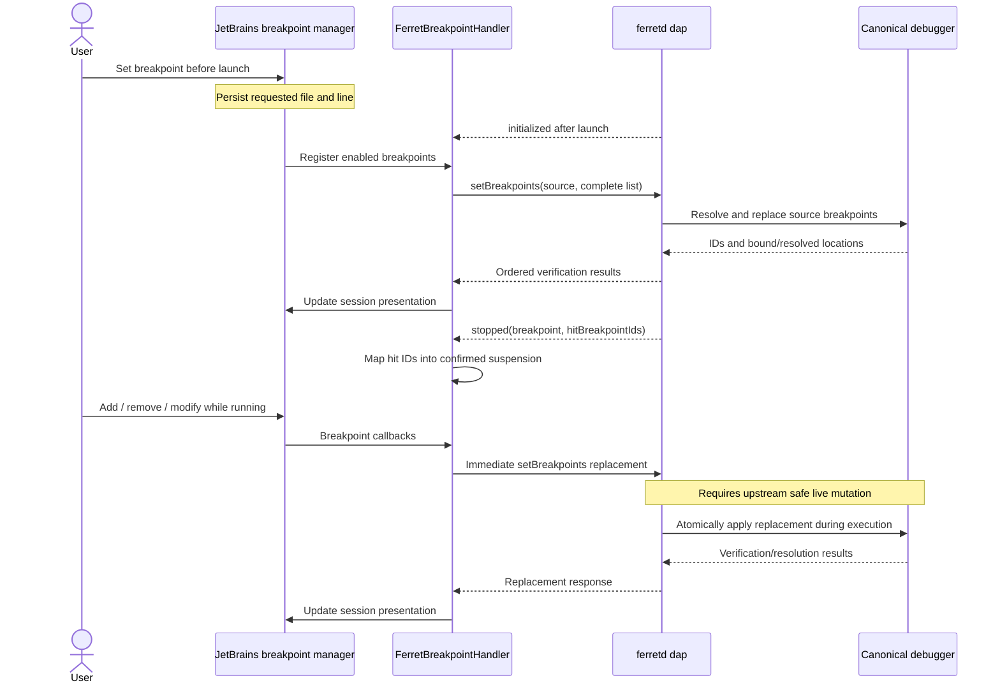

# M3 T1: JetBrains debugger architecture spike

Current status (September 22, 2026): M3 T2/T3 implement the selected native
XDebugger → LSP4J Debug → per-launch `ferretd dap` architecture against the sole
repository pin `1.0.0-alpha.8`. Run and Debug share launch-input resolution;
breakpoints, control commands, stacks, source navigation, console output, and
session cleanup are implemented. M3 T3 adds lazy Locals/Parameters groups, typed
values, selected-frame expression evaluation, and native watches. Inspection
shares the ordered session queue, is invalidated per stop, and reports request
failures locally while transport loss remains session-fatal. Null launch bindings
are preserved by a parameter-specific DAP serializer.
See the [current README](../README.md#debugging) for supported
behavior and source-snapshot limitations. The original spike text below is
historical evidence, including its alpha.6 blockers and then-future task lists;
it is not the current capability summary.

Alpha.8 fixes the first-executable-statement breakpoint failure recorded with
alpha.7. The [debugger validation report](debugger-validation.md) retains that
historical evidence and records follow-up validation. The manual UI pass
remains unverified, so T2 is not an unconditional release sign-off.

Status: architecture decision and implementation plan, recorded September 8,
2026. This task adds documentation only. JetBrains debugging is not implemented
by this change; M3 T2 and T3 below are future implementation work.

## 1. Decision and evidence baseline

Use **one `ferretd dap` process per JetBrains Debug launch**, with a thin DAP
adapter feeding the public XDebugger APIs.

```text
Ferret Run Configuration
    ├── Run   → project ferretd serve → execution
    └── Debug → per-launch ferretd dap → retained debugger session
```

A new gRPC debug service is unnecessary. Three upstream prerequisites remain
before the requested debugger can ship:

1. Safe, atomic breakpoint replacement while execution is running.
2. A separate DAP runtime working-directory argument.
3. Correct Unicode source locations through compilation and DAP conversion.

The evidence baseline is Editorium `e2f694e`, with the root daemon pin at
`1.0.0-alpha.6`. That daemon bundles Ferret `v2.0.0-alpha.53` and Universal API
`v1.0.0-alpha.13`. The exact cached SDK inspected was IntelliJ IDEA
`2026.2.0.1`, build `262.8665.337`.

Sibling Ferret, Universal API, and `ferretd` sources were also inspected. Some
changes were uncommitted during the spike; these sources establish development
contracts, not released behavior. When recording this report, Ferret was at
`1417760c85548a27e0d7280e446e90c674097d42`, Universal API at
`d391047197579474b4084f099ae6c3c9c3923cba`, and `ferretd` at
`8b653fffa251b8ddaa4a9ffec6bfde15764bcd69` with local migration changes.
Released behavior and proposed upstream fixes are distinguished below.

The [JetBrains build configuration](../build.gradle.kts) targets Java 25 and
already treats internal and deprecated API usage as verifier failures. Exact
SDK signatures and annotations were inspected locally; links to JetBrains'
current source below explain the public contracts but do not expand the tested
compatibility range.

### Public API mapping

| API | Intended use |
| --- | --- |
| `XDebuggerManager` | Obtain the project service and create sessions through `newSessionBuilder`. |
| `XDebugSessionBuilder`, `XSessionStartedResult` | Start the session with its `ExecutionEnvironment`; return the result's content descriptor to the runner. |
| `XDebugSession` | Platform-owned session; receive suspension, resumption, error, and breakpoint-presentation updates. |
| `XDebugProcess` | Extend for debugger commands, console, process handler, breakpoint handlers, and editors provider. |
| `XLineBreakpointType` | Register persisted Ferret line breakpoints independently of any launch. |
| `XBreakpointHandler` | Adapt registration/removal callbacks to DAP source-wide breakpoint replacement. |
| `XSuspendContext`, `XExecutionStack`, `XStackFrame` | Represent one confirmed stop, its logical stack, and its frames. |
| `XValueContainer`, `XValue`, `XValueGroup` | Load scopes and expandable values through native debugger trees. |
| `XDebuggerEvaluator` | Frame-scoped expression evaluation and standard watches. |
| `XDebuggerEditorsProvider` | Supply ordinary expression documents for Ferret evaluation. |
| `XSourcePosition`, `XDebuggerUtil` | Create positions through public factories using local `VirtualFile` identity. |

`XDebuggerManager`, `XDebugSession`, the builder, and the start result are
platform-owned, non-extendable contracts. The plugin consumes them.

The exact SDK deprecates `startSession`, `startSessionAndShowTab`, parameterless
stepping/resume overloads, and `XDebugSession.getRunContentDescriptor()`. Use
`newSessionBuilder`, context-taking command overrides, and
`XSessionStartedResult.getRunContentDescriptor()`. An asynchronous runner returns
that descriptor through the normal runner result. Avoid debugger implementation
classes, frontend proxies, internal flows/descriptors, and direct tab/UI access.
JetBrains' source documents the builder-based runner integration in the
[XDebugProcess contract](https://raw.githubusercontent.com/JetBrains/intellij-community/master/platform/xdebugger-api/src/com/intellij/xdebugger/XDebugProcess.java).

### Registrations and dependencies

The implementation needs these plugin registrations:

```xml
<depends>com.intellij.modules.xdebugger</depends>
<!-- Within the com.intellij extensions block: -->
<programRunner implementation="org.ferretlang.jetbrains.debugger.FerretDebugRunner"/>
<xdebugger.breakpointType implementation="org.ferretlang.jetbrains.debugger.FerretBreakpointType"/>
```

Add `bundledModule("intellij.platform.debugger")` in Gradle. The debugger module
exists in the inspected 2026.2 distribution. Declare it explicitly when
implementing the debugger; JetBrains documents separate debugger classloaders
and the explicit Gradle dependency requirement for 2026.3. This does not itself
establish tested 2026.3 compatibility. See the
[2026.x API changes](https://plugins.jetbrains.com/docs/intellij/api-changes-list-2026.html).

No Java debugger, CIDR, or separate persisted Debug Configuration is required.

### DAP alternatives

| Option | Finding |
| --- | --- |
| Direct debug gRPC | `debug.proto` is an ungenerated placeholder; `serve` registers only daemon, workspace, and execution services. Rejected by the agreed direction. |
| DAP adapted to XDebugger | Selected. Preserves the existing external debugger contract and process ownership. |
| JetBrains generic DAP integration | Present in the SDK, but `DapClient`, `DapDebugSession`, `DapProcessStarter`, and related entry points are experimental. Avoid as the production foundation. |

Use **Eclipse LSP4J Debug 0.24.0**, matching the library inspected in the target
SDK, through an explicit plugin dependency on
`org.eclipse.lsp4j:org.eclipse.lsp4j.debug:0.24.0` and its required transitive
artifacts. Do not rely on accidental SDK classpath availability or import
JetBrains' experimental wrappers.

LSP4J supplies DAP message types, framing, correlation, and asynchronous
requests. Editorium needs only a session-specific transport wrapper and event
adapter. Its launcher accepts a supplied executor, allowing platform-managed
execution. See the
[LSP4J client documentation](https://github.com/eclipse-lsp4j/lsp4j/blob/main/documentation/README.md)
and
[DSPLauncher](https://raw.githubusercontent.com/eclipse-lsp4j/lsp4j/main/org.eclipse.lsp4j.debug/src/main/java/org/eclipse/lsp4j/debug/launch/DSPLauncher.java).

## 2. Launch, components, ownership, and lifecycle

### Run Configuration integration

Register `FerretDebugRunner` for `DefaultDebugExecutor.EXECUTOR_ID` and
`FerretRunConfiguration`. Preserve the existing configuration type, identifier,
persistence, producer, and settings UI.

Extract the existing launch-input resolution into a narrowly named shared
JetBrains launch boundary. Both executors must use the same rules:

- Source is a saved, eligible local `.fql` file.
- Canonical project base is the compilation workspace; source-parent fallback
  applies only when no project base exists. An invalid project base is an error.
- Source must remain within the compilation workspace.
- Runtime working directory is independently optional and may be outside that
  workspace. An explicitly invalid directory must fail without fallback.
- Relative configured paths require a project base.
- Parameters preserve the existing typed JSON value tree: nulls, booleans,
  finite numbers, strings, arrays, and objects.

The current
[execution request resolver](../src/main/kotlin/org/ferretlang/jetbrains/execution/FerretExecutionRequest.kt)
owns path and parameter resolution. Share the existing saved-source validation
from the Run launch boundary as well. Move these responsibilities without
changing Run behavior or rewriting persisted inputs.

Construct DAP launch arguments as follows:

| Argument | Value |
| --- | --- |
| `program` | Canonical absolute source path. |
| `cwd` | Canonical compilation workspace. |
| `parameters` | Existing semantic parameter bindings represented as a JSON object. |
| `stopOnEntry` | `false`, preserving the adapter default. |
| `workingDirectory` | Proposed upstream argument; canonical runtime directory when configured, otherwise omitted. |

The last field requires upstream implementation. Alpha.6 silently ignores it.
Setting the child process directory also fails to provide equivalent semantics:
a live probe still read from the compilation workspace. Do not ship an adapter
that silently ignores the configured runtime directory.

The Debug runner must not invoke the existing Run execution path. It creates
the XDebugger session and starts its independent DAP launch.

### Proposed components

| Component | Responsibility |
| --- | --- |
| `FerretDebugRunner` | Debug executor selection and modern XDebugger session startup. |
| Shared launch input/resolver | Source, workspace, runtime directory, parameters, and saved-source validation. |
| `FerretDebugLauncher` | Project service with an injected coroutine scope; starts independently owned launch jobs without a session registry. |
| `FerretDebugProcess` | Thin XDebugger command/event adapter and owner of session-facing presentation. |
| `FerretDapSession` | One launch's lifecycle, capabilities, command state, stop generation, and cleanup. |
| `FerretDapTransport` | LSP4J connection, ordered event delivery, request completion, and stream failure. |
| `FerretDebugProcessHandler` | Native console/process lifecycle bridge; Stop delegates to the same idempotent session shutdown. |
| `FerretBreakpointType`, `FerretBreakpointHandler` | Persisted line-breakpoint eligibility and per-session DAP synchronization. |
| `FerretExecutionStack`, `FerretStackFrame` | Stack loading, frame identity, source positions, scopes, and evaluator access. |
| `FerretValue` | Typed value presentation and lazy child requests. |
| `FerretDebuggerEvaluator`, `FerretDebuggerEditorsProvider` | Native evaluation callbacks and expression documents. |
| `FerretSourcePositions` | The single path/coordinate conversion boundary. |

Small suspend-context and scope-group adapters can remain local implementations
where they need no independent lifecycle.

### Upstream object mapping and launch handshake

A DAP launch creates an in-process workspace, an execution Session retaining
compiled source, and one retained DebugSession over its debug Plan/runtime.
Native/Universal commands control that retained execution; `ferretd` turns their
outcomes into asynchronous DAP events.

Between requests, the process retains the source snapshot, plans, runtime,
parameters, breakpoints, and paused execution state. Frame/scope/value handles
survive only within their paused state. The released
[DAP handlers](https://github.com/MontFerret/ferretd/blob/v1.0.0-alpha.6/internal/dap/requests.go)
and
[DAP lifecycle implementation](https://github.com/MontFerret/ferretd/blob/v1.0.0-alpha.6/internal/dap/server.go)
own this composition and cleanup.

```mermaid
sequenceDiagram
    actor User
    participant Runner as FerretDebugRunner
    participant IDE as XDebugSession / FerretDebugProcess
    participant Session as FerretDapSession
    participant DAP as Per-launch ferretd dap

    User->>Runner: Debug existing Ferret configuration
    Runner->>IDE: newSessionBuilder(...).environment(...).startSession()
    Runner->>Session: Start project-owned launch job
    Session->>DAP: Spawn bundled binary; initialize
    DAP-->>Session: Capabilities
    Session->>DAP: launch(program, cwd, parameters, workingDirectory)
    DAP-->>Session: initialized
    IDE->>Session: Initialize and synchronize breakpoints
    Session->>DAP: setBreakpoints
    DAP-->>Session: Verification results
    Session->>DAP: configurationDone
    DAP-->>Session: configurationDone response
    DAP-->>Session: launch response
    DAP-->>Session: stopped when runtime suspends
    Session->>DAP: stackTrace
    Session->>IDE: Confirmed suspend context
    IDE->>Session: Load selected frame scopes/children
    Session->>DAP: scopes / variables / evaluate
    User->>IDE: Step or Resume
    IDE->>Session: Corresponding command
    Session->>DAP: next / stepIn / stepOut / continue
    DAP-->>Session: Response, then later stop or terminal events
    User->>IDE: Stop
    IDE->>Session: Idempotent asynchronous shutdown
    Session->>DAP: terminate, then disconnect
    Session->>Session: Close streams; await process; release resources
```

Launch must remain pending while `initialized`, breakpoint configuration, and
`configurationDone` are processed. Awaiting `launch` before configuring
breakpoints would deadlock the handshake. The command/event sequence above is
illustrative: a fast stop must also remain correct if it arrives before a
command's successful callback is applied locally.

### Concurrency and disposal

- Multiple debug launches use separate DAP processes. A live probe verified that
  terminating A leaves B inspectable and runnable.
- Run and Debug can coexist because their processes and resource graphs are
  independent. This is supported by the topology; a full JetBrains
  Run-plus-Debug test remains an implementation acceptance test.
- Different projects receive separate launch scopes, processes, transport
  objects, and breakpoint mappings.
- Project close cancels every project-owned Debug job. Each job performs
  bounded cleanup of its own process.
- Stop sends DAP termination; it never calls Run's `CancelExecution`, shuts down
  `FerretdDaemonConnection`, or touches LSP.
- `terminated` does not guarantee the adapter process has exited. Send
  `disconnect` and finish process cleanup after normal completion too.
- Retain completed Debug console output in the native tool window while
  releasing runtime resources.

Reuse `FerretdBinary` and installation validation. The authenticated TCP
launcher, channel, workspace cache, and daemon-generation machinery remain
specific to Run and are not reused by DAP.

## 3. Source positions and breakpoints

### Coordinate contract

The Universal API carries source names and positions without prescribing a
filesystem identity or universal offset encoding. Current native Ferret
produces one-based lines and byte columns, with zero-based half-open byte spans.

JetBrains uses zero-based lines and UTF-16 document offsets. DAP specifies
UTF-16 column units. The current daemon changes coordinate bases but does not
perform the necessary byte-to-UTF-16 conversion. See the
[DAP coordinate specification history](https://microsoft.github.io/debug-adapter-protocol/changelog).

The implementation target is:

1. Ferret publishes correct byte spans.
2. `ferretd` converts native positions to/from standard DAP UTF-16 coordinates
   using the retained source.
3. JetBrains initializes with explicit one-based lines/columns and
   `pathFormat: "path"`.
4. `FerretSourcePositions` alone converts DAP bases and constructs
   `XSourcePosition` through `XDebuggerUtil`.

For line breakpoints, send the line and omit the optional column. Do not
implement native byte/rune correction in Kotlin.

Canonical absolute launch paths provide the normal identity. Relative returned
paths resolve against the compilation workspace. Missing sources remain
unavailable positions; they must not resolve to an unrelated file. Anonymous
sources and nonzero DAP source references are outside the existing file-backed
transport.

Alpha.6 has an additional upstream Unicode defect: a probe containing an emoji
on line one produced an unverified breakpoint on executable line three. The
inspected newer Ferret source contains compiler span normalization addressing
the underlying rune/byte mismatch, but that is not evidence that the bundled
release is fixed.

Debug execution retains a source snapshot. Editing source during a session
does not recompile it; document the need to relaunch rather than inventing
source remapping.

### Breakpoint behavior

- `canPutAt` accepts valid lines in eligible local Ferret files. It does not
  parse Ferret to decide executability.
- JetBrains stores breakpoints before any session exists.
- Delay session breakpoint initialization until DAP sends `initialized`; then
  call `initBreakpoints()` and finish synchronization before
  `configurationDone`.
- Use full `setBreakpoints` replacement for each source. Removing the last
  breakpoint sends an empty list.
- Map response entries to the submitted breakpoints by order and retain
  returned DAP IDs for hit events.
- Modification, enable/disable, removal, and mute changes propagate through the
  same handler.
- **While running, send changes immediately.** Safe upstream live replacement
  is a prerequisite; there is no JetBrains queue waiting for suspension and no
  automatic pause.

Current Ferret supports exact and next-executable binding modes internally.
The DAP contract chooses next executable in the launched source. Preserve that
choice.

Breakpoints in other files receive successful unverified responses without
changing the launched program's breakpoint state. Preserve those results and
messages.

| Upstream result | JetBrains presentation |
| --- | --- |
| Verified at requested location | `setBreakpointVerified`. |
| Verified at another location | Verified presentation plus resolved-location message; retain the requested persisted breakpoint. |
| Unbound/unverified | Session-local pending/unverified icon and upstream message, or a concise unresolved-location message when absent. |
| Invalid request or failed synchronization | Invalid presentation and actionable error. |
| Breakpoint hit | Resolve returned hit IDs to the corresponding session mapping. |

Use `XDebugSession.updateBreakpointPresentation` for messages and icons. Set
`canBeHitInOtherPlaces()` because executable resolution may move the effective
stop. Do not rewrite the persisted breakpoint's position based on one session's
result. These are supported public presentation hooks in the
[breakpoint API](https://raw.githubusercontent.com/JetBrains/intellij-community/master/platform/xdebugger-api/src/com/intellij/xdebugger/breakpoints/XLineBreakpointType.java)
and
[session presentation API](https://raw.githubusercontent.com/JetBrains/intellij-community/master/platform/xdebugger-api/src/com/intellij/xdebugger/XDebugSession.java).

Disable conditional, log, hit-count, suspend-none, and dependent-breakpoint UI
for this type. Supplying a frame evaluator does not authorize client-side
conditional-breakpoint simulation.



Serialize replacement requests and their response handling. Revision checks
prevent an older response from overwriting newer presentation. An already-decided
stop may race with removal; display that confirmed stop without silently
continuing.

## 4. Inspection, execution events, threading, and recovery

### Canonical capabilities

The inspected
[Universal debugger Session](https://github.com/MontFerret/api/blob/d391047197579474b4084f099ae6c3c9c3923cba/debugger/session.go)
exposes start, continue, pause, all three stepping operations, breakpoint
operations, frames, frame locals, child values, and frame-scoped evaluation.
Native Ferret owns their semantics.

| Capability | Current behavior and XDebugger mapping |
| --- | --- |
| Start | Native start stops at entry. DAP suppresses that stop and continues when `stopOnEntry` is false. |
| Continue | `resume(XSuspendContext)` → DAP `continue`. |
| Pause | `startPausing()` → DAP `pause`; wait for `stopped`, not merely the response. |
| Step over | `startStepOver(context)` → `next`; next debuggable location at the same or shallower depth. |
| Step into | `startStepInto(context)` → `stepIn`; may enter a called function. |
| Step out | `startStepOut(context)` → `stepOut`; at the top level it runs to completion. |
| Threads | One logical thread, ID `1`, named `Ferret`. |
| Stack | Current frame first, callers afterward; `stackTrace` supports `startFrame` and `levels`. |
| Scopes | Exactly `Locals` and `Parameters`, derived upstream from the canonical parameter flag. |
| Evaluation | Paused, selected-frame, side-effect-free expression subset. |
| Termination | `terminate` ends execution; `disconnect` releases the adapter composition. |

Stepping operates on the logical execution thread, not the selected caller
frame. Breakpoints and manual pause can interrupt stepping. No local stepping
emulation is needed.

### Frames, scopes, and values

Expose one `FerretExecutionStack`. Load an initial frame page asynchronously,
then honor `computeStackFrames(firstFrameIndex, …)` with additional DAP pages.

Each frame carries its DAP frame ID, name, source position, and current stop
generation. Native function IDs are not transported by DAP; do not invent them.
DAP frame handles are unsuitable for equality across stops, so retain the
default absence of cross-stop equality.

`FerretStackFrame.computeChildren` fetches `scopes(frameId)`. Present the
returned scopes as native groups; fetch their variables on expansion. Further
expansion sends `variables(variablesReference)` only when a positive handle
exists.

Use upstream `type` and display text directly:

- `NONE`, booleans, numbers, and quoted strings remain typed leaves.
- Arrays and objects expand through handles.
- Host values retain upstream type/display and expand only when upstream
  provides a handle.
- Nested values use the same recursive adapter.
- No value modifier, object marker, or local full-value evaluator is provided.

There is **no variable paging support** in current DAP. Do not send filtering,
start, or count arguments.

A significant existing limit is that default formatting allows eight items:
collections larger than eight have a summary and no expandable reference. A
live probe returned `Array(9)` with reference `0`. Display that honestly;
complete large-collection inspection requires an upstream capability and is
not fabricated in Kotlin.

Handles are opaque and valid only while paused. Invalidate inspection work
when execution resumes, steps, or terminates. Guard all asynchronous results
with the session and stop generation, even though DAP already avoids handle
reuse.

### Evaluation and watches

`FerretStackFrame.getEvaluator()` supplies the standard evaluator. JetBrains
then uses it for Evaluate Expression and ordinary watches. See the
[XStackFrame evaluation contract](https://raw.githubusercontent.com/JetBrains/intellij-community/master/platform/xdebugger-api/src/com/intellij/xdebugger/frame/XStackFrame.java).

Send the expression unchanged with the selected DAP `frameId`. Return the
typed result as `FerretValue`; report evaluation failures through the native
callback.

The evaluator supports bindings, parameters, member/index access, and its
existing scalar expression operators. Calls, collection literals, queries,
mutation, and full program execution are excluded. Explicitly disable
code-fragment evaluation, whose platform default is enabled. See the
[XDebuggerEvaluator contract](https://raw.githubusercontent.com/JetBrains/intellij-community/master/platform/xdebugger-api/src/com/intellij/xdebugger/evaluation/XDebuggerEvaluator.java).

The shared evaluator callback does not reliably identify watch versus dialog
requests. Use the common evaluation request without guessing a DAP context;
enforce stale-state handling locally.

Expose evaluation expressions for valid top-level bindings. Current DAP
incorrectly uses bare child names as nested `evaluateName` values; do not offer
those as valid standalone watch expressions.

The baseline Debug console is the standard output console. An evaluator does
not automatically create an interactive REPL. Native `LanguageConsoleBuilder`
would require an additional execution handler; defer console input, with
evaluation available through Evaluate Expression and Watches.

### Suspension and output events

| DAP event/result | IDE action |
| --- | --- |
| `stopped(entry/step/pause)` | Build the confirmed suspend context and call `positionReached`. |
| `stopped(breakpoint)` | Use matching `breakpointReached`; preserve a real stop even if its breakpoint was concurrently removed. |
| `stopped(exception)` | Show the runtime failure and an inspectable stack. Continuing leads to failure output and termination. |
| Successful resume/step response | Transition to running and retire old inspection state. |
| `output(stdout)` | Native Debug console normal output. |
| `output(stderr)` | Native Debug console error output. |
| `exited` | Record the debuggee exit code. |
| `terminated` | End the session and initiate adapter cleanup. |
| Unexpected adapter EOF/exit | Fail the affected session clearly. |

Current DAP does not emit `continued`. Do not wait for one. Order state updates
so a fast `stopped` event cannot be overwritten by a delayed successful command
callback.

Current output consists primarily of final encoded results and runtime/adapter
failure messages; it is not a general live runtime-output stream. Process stderr
contains structured adapter diagnostics and belongs in IDE logging, separate
from user-facing DAP output. Raw protocol traffic must never reach the console.

### Threading and failure rules

- Use the project service's injected coroutine scope with an independent child
  job per launch. One launch failure must not cancel sibling launches.
- Resolve paths, start processes, read streams, issue requests, and await
  process exit off the EDT.
- Supply LSP4J a session-owned bounded executor backed by JetBrains facilities;
  do not create unmanaged threads.
- Event callbacks enqueue ordered state work and return promptly. Never await
  another DAP response on the reader callback.
- Apply IDE session and presentation updates on the appropriate UI dispatcher;
  use read actions for document/VFS access.
- Cancel obsolete stack, value, and evaluator callbacks on resume or disposal.
- Use bounded startup, request, and shutdown waits; running execution itself
  has no timeout.
- Make cleanup idempotent and cancellation-safe. After graceful shutdown times
  out, terminate only the owned DAP process and await its exit.

Variable/evaluation errors remain local to their node or callback. A failed
breakpoint replacement makes the session fail clearly because the current
replacement path can partially mutate state and offers no reconciliation
query. The upstream atomic replacement requirement below removes that partial
mutation hazard; the client should still treat failed synchronization as a
session failure rather than guessing the installed set.

Transport loss fails the session; a later launch starts a new process. No
automatic session recreation occurs.

## 5. Upstream prerequisites, implementation tasks, and validation

### Required upstream work

| Gap | Owner | Required contract |
| --- | --- | --- |
| Breakpoint replacement during execution | Ferret VM/debugger, Universal API contract, `ferretd` debug/DAP adaptation | Add/remove/update must complete safely while running, return normal verification results, and affect subsequent execution without waiting for a stop. Preserve pre-launch and paused behavior. |
| Replacement consistency | Ferret/`ferretd` | Publish a complete source replacement atomically; failure must not leave an undocumented partial set. Preserve valid hit identities across races with replacement, pause, termination, and completion. |
| Independent runtime directory | `ferretd` DAP | Add optional `workingDirectory`, mapped to existing runtime options. Keep `cwd` as compilation workspace; omission retains the workspace runtime default. |
| Unicode compiler locations | Ferret release integration | Include and validate correct rune-to-byte span normalization in the Ferret version bundled by `ferretd`. |
| DAP column units | `ferretd` DAP | Convert native byte columns to/from UTF-16 units at the protocol boundary using the retained source. |

For live breakpoints, simply removing `ferretd`'s running-state guard is
insufficient. Native mutation currently shares the command mutex held during
execution, and the VM receives a breakpoint map at resume. The upstream change
must provide actual safe live publication and keep Pause/Stop responsive.

The release dependency is Universal API → Ferret → `ferretd` → Editorium's root
daemon pin as required by the final upstream contracts. Do not select a future
version until its release contains and validates these prerequisites.

### Existing limitations, not new M3 requirements

- Large collections lack expandable handles and paging. Complete expansion
  would require Ferret inspection changes, a portable paging contract, and DAP
  adaptation.
- Nested `evaluateName` values are not qualified expressions; omit unsupported
  watch-expression affordances.
- Conditional/log/hit-count breakpoints, arbitrary evaluation, variable
  mutation, attach, reverse execution, and restart-in-place remain unsupported.
- Interactive console evaluation and automatic hover-expression extraction are
  outside the initial adapter.

### M3 T2: Transport, launch, breakpoints, and control

1. Land and release the required upstream contracts.
2. Update only the root daemon pin; evaluate both integrations' protocol and
   distribution compatibility.
3. Extract the shared launch-input boundary without changing Run behavior.
4. Add explicit debugger/LSP4J dependencies, the Debug runner, breakpoint type,
   and project launch scope.
5. Implement per-launch DAP transport, handshake, lifecycle, native console,
   and isolated Stop.
6. Implement immediate live breakpoint synchronization and verification
   presentation.
7. Add pause/resume/stepping, source conversion, and basic confirmed-stop stack
   display.

Do not ship a temporary delayed-breakpoint model or silently ignore configured
runtime directories.

### M3 T3: Inspection and complete native debugger behavior

1. Add paged stack loading and selected-frame scopes.
2. Add typed values and lazy children within upstream limits.
3. Add expression-only evaluation and normal watches.
4. Complete runtime-failure presentation, obsolete-request protection, and
   recovery behavior.
5. Document capabilities, limitations, process ownership, and Run/Debug
   configuration equivalence.
6. Complete concurrency, disposal, packaging, and compatibility validation.

### Implementation acceptance tests

- Initialization ordering, pending launch, initial breakpoint synchronization,
  and entry suppression.
- Breakpoint verification, relocation, other-file rejection, empty replacement,
  and rapid edits.
- Live add/remove/update during long-running execution, including simultaneous
  pause, stop, and completion.
- Unicode before later statements, supplementary characters, CRLF, relative
  paths, symlinks, Windows paths, and unavailable source.
- Identical Run/Debug source, parameter, workspace, and independent
  runtime-directory behavior.
- All three stepping modes, caller frames, manual pause, and inspectable
  runtime failures.
- Locals/Parameters, nested values, stale handles, nine-item collection limits,
  and selected-frame evaluation.
- Stop during startup/configuration/execution; repeated disposal; adapter crash
  and broken streams.
- Two Debug sessions, Run plus Debug, and multiple projects with sibling
  survival.
- Failed variable/evaluation requests and failed breakpoint synchronization.
- Actual packaged plugin contents and bundled daemon behavior.

Run the repository gates during implementation:

```sh
make build jetbrains
make lint jetbrains
make test jetbrains
```

`make test jetbrains` includes generated-client drift checks, unit tests, and
real-daemon integration tests through `ferretdIntegrationTest` with the pinned
current-host executable. The existing tests validate the currently implemented
plugin; debugger acceptance coverage must be added in T2/T3.

When the daemon pin changes, also run protocol checks and both integrations'
relevant packaging checks through the root Make interface. Complete the
mandatory full-diff, ownership, lifecycle, and documentation self-review.

### Validation completed during the spike

- Inspected exact SDK signatures, annotations, module metadata, and bundled
  LSP4J version.
- Inspected native, Universal API, retained-session, DAP, and existing Run
  contracts.
- Ran temporary alpha.6 DAP probes covering handshake, breakpoint stops, frames,
  scopes, lazy values, evaluation, completion, concurrent-session isolation,
  Unicode binding, and runtime-directory behavior.
- Confirmed the Unicode and runtime-directory failures and the large-collection
  limitation described above.
- Removed probe fixtures; `git diff --check` passed and Editorium's working
  tree remained clean at the end of the investigation.

These probes are spike evidence, not a committed debugger integration suite.
No native JetBrains debugger was implemented or manually exercised. The
architecture self-review is complete; the upstream prerequisites remain
implementation blockers.

### Documentation delivery validation

The report and its README link are the only repository changes for M3 T1.
There are no production changes, new tests, dependency changes, daemon pin
changes, or generated-client changes.

Validation on September 8, 2026:

| Command/check | Result |
| --- | --- |
| `make build jetbrains` | Passed; Gradle reused up-to-date build and plugin structure outputs. |
| `make lint jetbrains` | Passed, including generated-client drift checks and Plugin Verifier compatibility with `IU-262.8665.337`. |
| `make test jetbrains` | Passed. Gradle reused the successful 124-test unit result and reran all 12 real-daemon integration tests successfully. |
| Local documentation links | All three relative file links resolved. |
| Complete-diff self-review | Reviewed scope, API/semantic ownership, process lifecycle, evidence versus proposals, and README consistency. |

The Make commands used a valid local `TMPDIR` and access to existing build
caches. No separate `make package-check jetbrains` was run; the daemon pin and
distribution inputs are unchanged. These checks validate the existing plugin
and this documentation delivery, not the future debugger acceptance tests
above.
